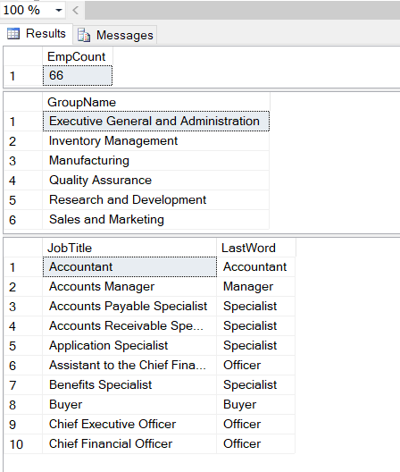

## Вариант 10
## Дубовская Екатерина, 751001

1. Вывести на экран количество сотрудников, позиция которых в организации соответствует 3-ему уровню (OrganizationLevel).
2. Вывести на экран список неповторяющихся названий групп отделов из таблицы Department.
3. Вывести на экран список неповторяющихся должностей в порядке A-Z. Вывести только первые 10 названий. Добавить столбец, в котором вывести последнее слово из поля [JobTitle].

### Результаты работы 3 криптов:

