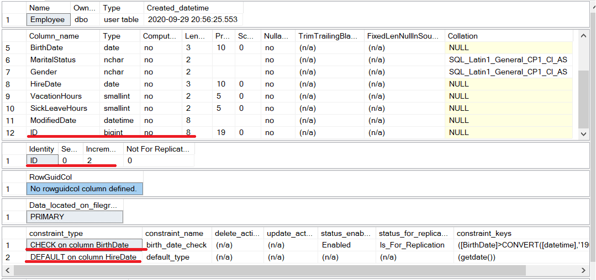

## Вариант 10
## Дубовская Екатерина, 751001

## Задание 1
1. Вывести на экран почасовую ставку каждого сотрудника, округленную до целого числа.
2. Вывести на экран порядковый номер изменения почасовой ставки для каждого сотрудника по дате изменения ставки.
3. Вывести на экран информацию об отделах и работающих в них сотрудниках, отсортированную по полю JobTitle, а затем по полю HireDate в порядке убывания (если JobTitle сотрудника содержит одно слово) или по полю BirthDate в порядке убывания (если JobTitle сотрудника содержит несколько слов).

### Результаты выполнения Задачи 1:

#### 2.1.1

#### 2.1.3

#### 2.1.3

## Задание 2
1. создайте таблицу dbo.Employee с такой же структурой как HumanResources.Employee, кроме полей OrganizationLevel, SalariedFlag, CurrentFlag, а также кроме полей с типом hierarchyid, uniqueidentifier, не включая индексы, ограничения и триггеры;
2. используя инструкцию ALTER TABLE, добавьте в таблицу dbo.Employee новое поле ID, которое является первичным ключом типа bigint и имеет свойство identity. Начальное значение для поля identity задайте 0 и приращение задайте 2;
3. используя инструкцию ALTER TABLE, создайте для таблицы dbo.Employee ограничение для поля BirthDate, запрещающее заполнение поля датами ранее 1900 года и позже текщей даты;
4. используя инструкцию ALTER TABLE, создайте для таблицы dbo.Employee ограничение DEFAULT для поля HireDate, задайте значение по умолчанию текущую дату;
5. заполните новую таблицу данными из HumanResources.Employee только для тех сотрудников, у которых EmailPromotion = 0 в таблице Person.Person. Поле HireDate заполните значениями по умолчанию;
6. измените тип поля MaritalStatus на NVARCHAR(1) и разрешите добавление null значений для него.

### Результаты выполнения Задачи 1:

#### 2.2.1

#### 2.2.2-4

#### 2.2.5

#### 2.2.6

