## Вариант 10
## Дубовская Екатерина, 751001

## Задание 1
1. добавьте в таблицу dbo.Employee поле Name типа nvarchar размерностью 60 символов;

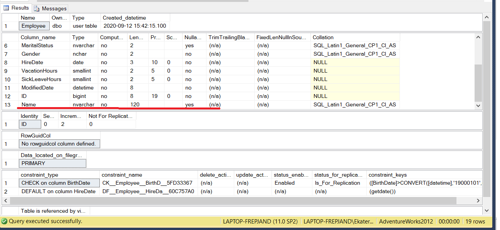

2. объявите табличную переменную с такой же структурой как dbo.Employee и заполните ее данными из dbo.Employee. Поле Name заполните данными таблицы Person.Person, из полей Title и FirstName. Если Title содержит null значение, замените его на ‘M.’;
3. обновите поле Name в dbo.Employee данными из табличной переменной;

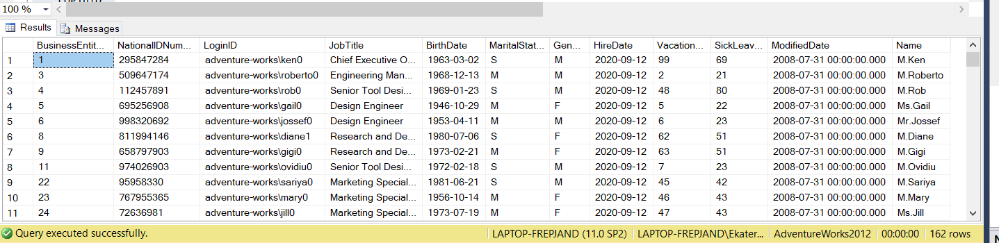
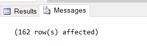

4. удалите из dbo.Employee сотрудников, которые хотя бы раз меняли отдел (таблица HumanResources.EmployeeDepartmentHistory);

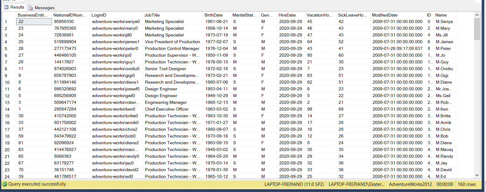

5. удалите поле Name из таблицы, удалите все созданные ограничения и значения по умолчанию.

Имена ограничений вы можете найти в метаданных. Например:
```SQL
SELECT *
FROM AdventureWorks2012.INFORMATION_SCHEMA.CONSTRAINT_TABLE_USAGE
WHERE TABLE_SCHEMA = 'dbo' AND TABLE_NAME = 'Employee';
```
Имена значений по умолчанию найдите самостоятельно, приведите код, которым пользовались для поиска;

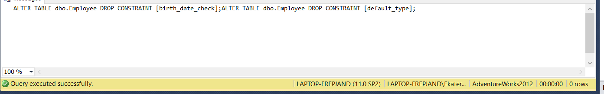
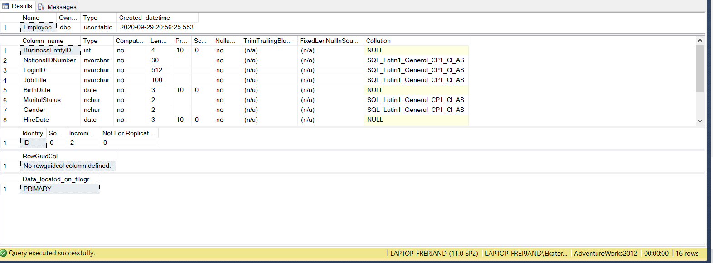

6. удалите таблицу dbo.Employee.

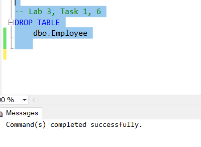


## Задание 2
1. Выполните код, созданный во втором задании второй лабораторной работы. Добавьте в таблицу dbo.Employee поле SumSubTotal MONEY. Также создайте в таблице вычисляемое поле LeaveHours, вычисляющее сумму часов отпуска и больничных в полях VacationHours и SickLeaveHours.

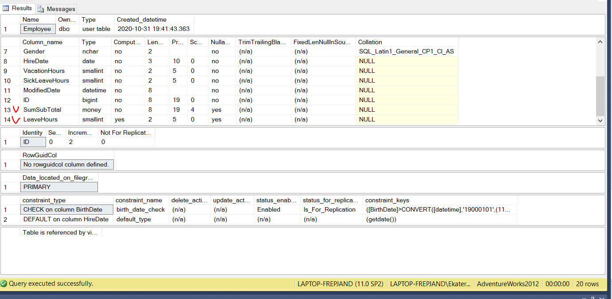

2. создайте временную таблицу #Employee, с первичным ключом по полю ID. Временная таблица должна включать все поля таблицы dbo.Employee за исключением поля LeaveHours.

3. заполните временную таблицу данными из dbo.Employee. Посчитайте общую сумму без учета налогов и стоимости доставки (SubTotal), на которую сотрудник (EmployeeID) оформил заказов в таблице Purchasing.PurchaseOrderHeader и заполните этими значениями поле SumSubTotal. Подсчет суммы осуществите в Common Table Expression (CTE).


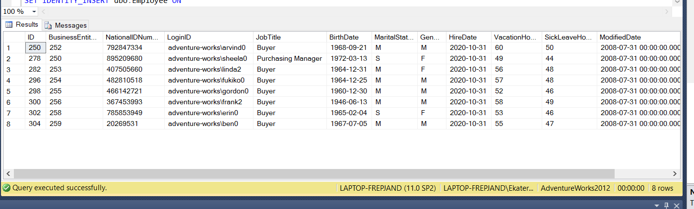

4. удалите из таблицы dbo.Employee строки, где LeaveHours > 160

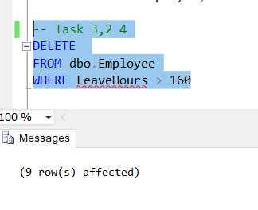

5. напишите Merge выражение, использующее dbo.Employee как target, а временную таблицу как source. Для связи target и source используйте ID. Обновите поле SumSubTotal, если запись присутствует в source и target. Если строка присутствует во временной таблице, но не существует в target, добавьте строку в dbo.Employee. Если в dbo.Employee присутствует такая строка, которой не существует во временной таблице, удалите строку из dbo.Employee.

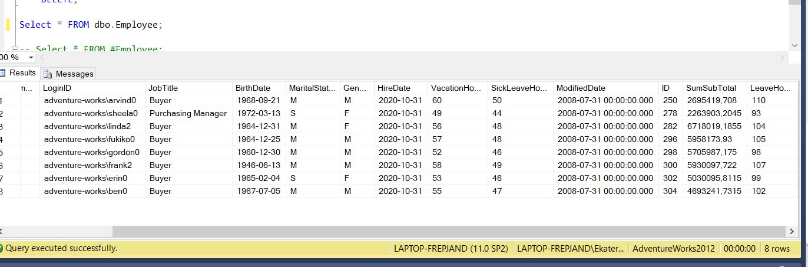


