## Вариант 10
## Дубовская Екатерина, 751001

## Задание 1
1. Создайте таблицу Sales.SalesReasonHst, которая будет хранить информацию об изменениях в таблице Sales.SalesReason.

Обязательные поля, которые должны присутствовать в таблице: 
ID — первичный ключ IDENTITY(1,1); 
Action — совершенное действие (insert, update или delete); 
ModifiedDate — дата и время, когда была совершена операция; 
SourceID — первичный ключ исходной таблицы; UserName — имя пользователя, совершившего операцию. Создайте другие поля, если считаете их нужными.

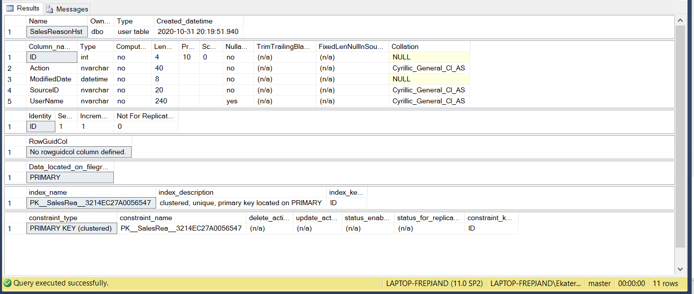

2. Создайте три AFTER триггера для трех операций INSERT, UPDATE, DELETE для таблицы Sales.SalesReason. Каждый триггер должен заполнять таблицу Sales.SalesReasonHst с указанием типа операции в поле Action.

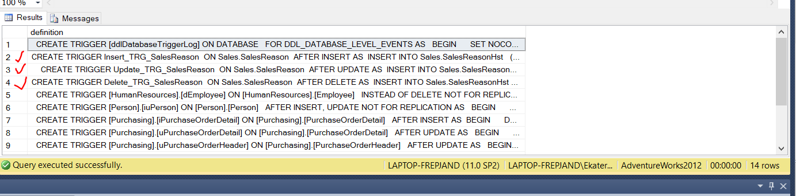

3. Создайте представление VIEW, отображающее все поля таблицы Sales.SalesReason. Сделайте невозможным просмотр исходного кода представления.

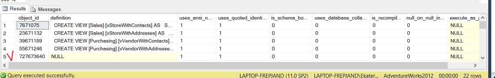

4. Вставьте новую строку в Sales.SalesReason через представление. Обновите вставленную строку. Удалите вставленную строку. Убедитесь, что все три операции отображены в Sales.SalesReasonHst.

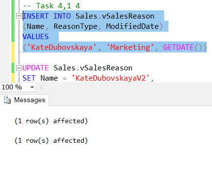
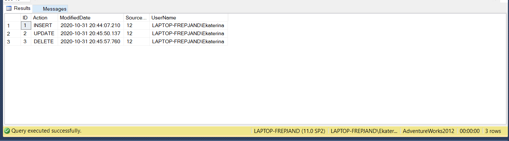

## Задание 2
1. Создайте представление VIEW, отображающее данные из таблиц Sales.SalesReason и Sales.SalesOrderHeaderSalesReason, а также CustomerID из таблицы Sales.SalesOrderHeader. Создайте уникальный кластерный индекс в представлении по полям SalesReasonID, SalesOrderID.

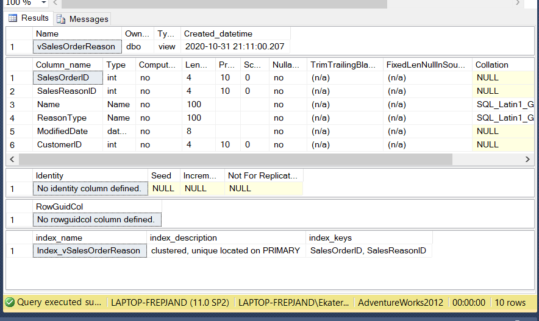

2. Создайте один INSTEAD OF триггер для представления на три операции INSERT, UPDATE, DELETE. Триггер должен выполнять соответствующие операции в таблицах Sales.SalesReason и Sales.SalesOrderHeaderSalesReason для указанного CustomerID. Обновление не должно происходить в таблице Sales.SalesOrderHeaderSalesReason. Удаление из таблицы Sales.SalesReason производите только в том случае, если удаляемые строки больше не ссылаются на Sales.SalesOrderHeaderSalesReason.

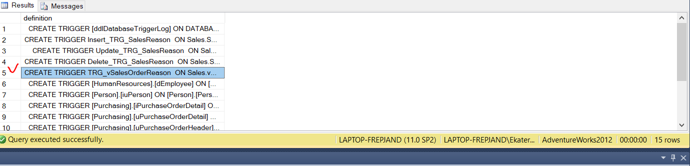

3. Вставьте новую строку в представление, указав новые данные SalesReason для существующего CustomerID (например для 11000). Триггер должен добавить новые строки в таблицы Sales.SalesReason и Sales.SalesOrderHeaderSalesReason. Обновите вставленные строки через представление. Удалите строки

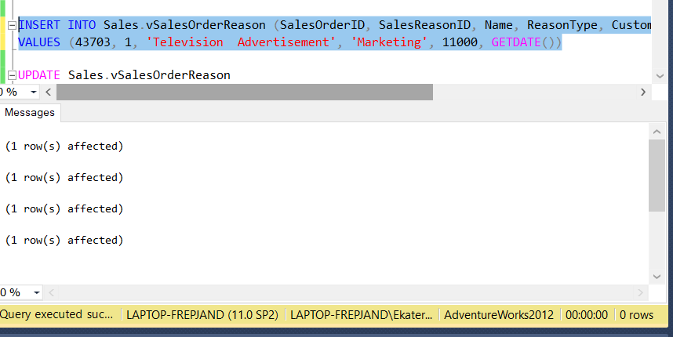

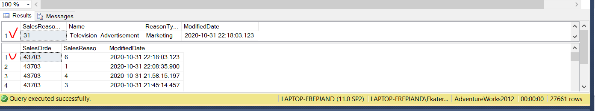

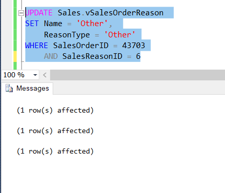

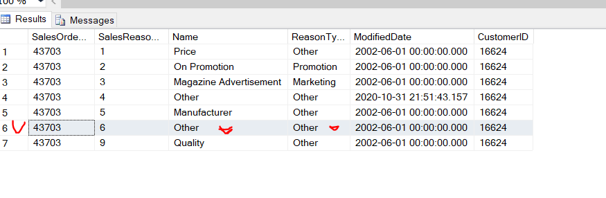

