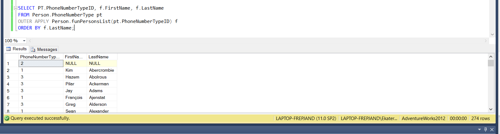

## Вариант 10
## Дубовская Екатерина, 751001

## Задание 1
1. Создайте scalar-valued функцию, которая будет принимать в качестве входного параметра id для типа телефонного номера (Person.PhoneNumberType.PhoneNumberTypeID) и возвращать количество телефонов указанного типа (Person.PersonPhone).

2. Создайте inline table-valued функцию, которая будет принимать в качестве входного
параметра id для типа телефонного номера (Person.PhoneNumberType.PhoneNumberTypeID), а возвращать список сотрудников из Person.Person (сотрудники обозначены как PersonType = ‘EM’), телефонный номер которых принадлежит к указанному типу.

3. Вызовите функцию для каждого типа телефонного номера, применив оператор CROSS
APPLY. 

4. Вызовите функцию для каждого типа телефонного номера, применив оператор
OUTER APPLY.

5. Измените созданную inline table-valued функцию, сделав ее multistatement table-valued
(предварительно сохранив для проверки код создания inline table-valued функции).

