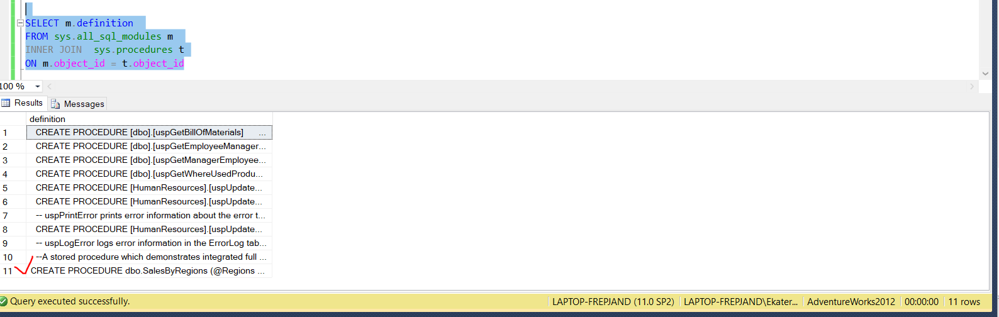
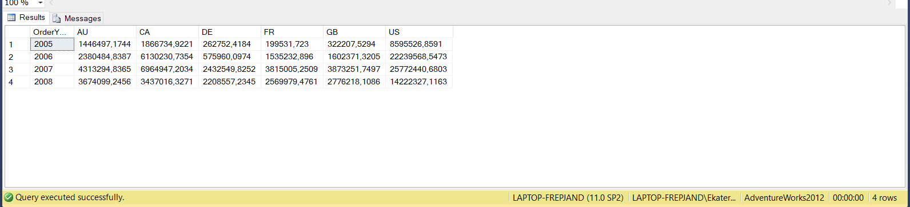

## Вариант 10
## Дубовская Екатерина, 751001

## Задание 1
1. Создайте хранимую процедуру, которая будет возвращать сводную таблицу (оператор PIVOT), отображающую данные об итоговой сумме продаж за каждый год
(Sales.SalesOrderHeader.OrderDate) по определенному региону (Sales.SalesTerritory.CountryRegionCode). Список регионов передайте в процедуру через входной параметр.
Таким образом, вызов процедуры будет выглядеть следующим образом:
``` SQL
    EXECUTE dbo.SalesByRegions ‘[AU],[CA],[DE],[FR],[GB],[US]’
```






