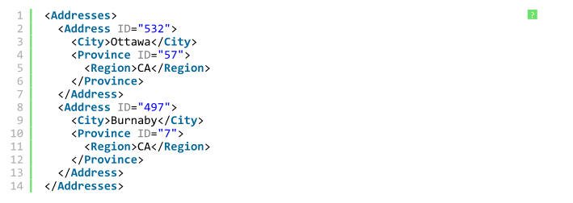
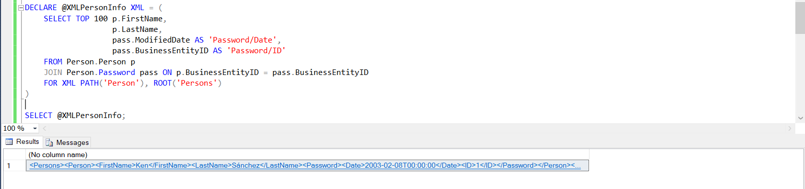
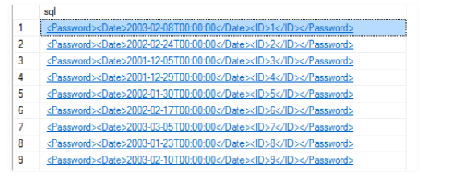
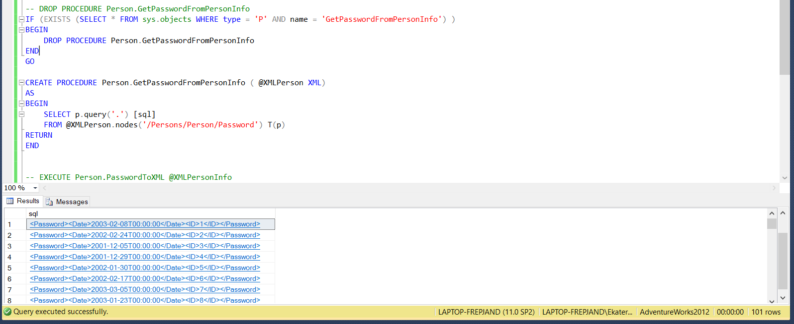

## Вариант 10
## Дубовская Екатерина, 751001

## Задание 1
1. Вывести значения полей [FirstName], [LastName] из таблицы [Person].[Person] и полей [Modi?edDate] и [BusinessEntityID] из таблицы [Person].[Password] в виде xml, сохраненного в переменную. Вывести только первые 100 записи из таблицы. Формат xml должен соответствовать примеру:

2. Создать хранимую процедуру, возвращающую таблицу, состоящую из 1 колонки и заполняет её xml, содержащимся в тегах Password. Вызвать эту процедуру для заполненной на первом шаге переменной

